<picture>
  <source media="(prefers-color-scheme: dark)" srcset="banner/dark.svg">
  
</picture>

<h3 align="center">Content &amp; Creative Strategist</h3>

Design · Content · Marketing · Multimedia · Branding · Digital · AI &amp; Creative Technology

<!-- stats -->

<picture>
  <source media="(prefers-color-scheme: dark)" srcset="https://raw.githubusercontent.com/abhayvikyathofficial/abhayvikyathofficial/output/streak-stats-dark.svg">
  
</picture>

<picture>
  <source media="(prefers-color-scheme: dark)" srcset="https://github-readme-stats-seven-mu-71.vercel.app/api?username=abhayvikyathofficial&amp;hide_rank=true&amp;show_icons=true&amp;include_all_commits=true&amp;count_private=true&amp;bg_color=0A101F&amp;title_color=22D3EE&amp;text_color=E2E8F0&amp;icon_color=A78BFA&amp;border_color=1E293B&amp;border_radius=10">
  
</picture>
<picture>
  <source media="(prefers-color-scheme: dark)" srcset="https://github-readme-stats-seven-mu-71.vercel.app/api/top-langs?username=abhayvikyathofficial&amp;layout=compact&amp;langs_count=8&amp;bg_color=0A101F&amp;title_color=22D3EE&amp;text_color=E2E8F0&amp;border_color=1E293B&amp;border_radius=10">
  
</picture>

<!-- snake -->

<picture>
  <source media="(prefers-color-scheme: dark)" srcset="https://raw.githubusercontent.com/abhayvikyathofficial/abhayvikyathofficial/output/github-snake-dark.svg">
  
</picture>

<!-- badges -->

  &nbsp;&nbsp;
  &nbsp;&nbsp;
  &nbsp;&nbsp;
  &nbsp;&nbsp;
  &nbsp;&nbsp;
  &nbsp;&nbsp;
  

<!-- tools -->

  
  
  
  
  
  
  

  

